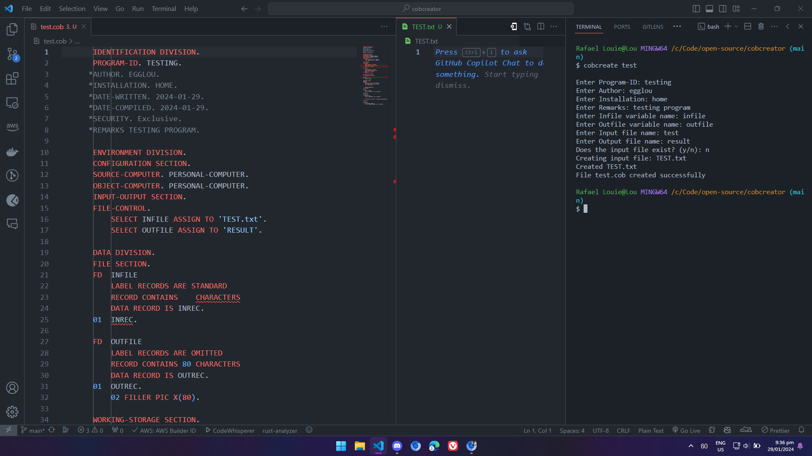

# COBOL Template Generator

COBOL Template Generator is a command-line interface (CLI) application written in Rust. It allows users to create a COBOL file with user-defined parameters. The application generates the boilerplate for a COBOL program, saving you time and ensuring consistency across your COBOL files.

## Installation

### Using Executable (Recommended)

To install the application, download the latest release from the [releases page](https://github.com/egg-lou/Cobol-Template-Generator/releases/tag/V1.0.0). You will find an executable file that you can download and run on your machine.

After downloading the executable, you need to add it to your system's PATH environment variable. This process varies depending on your operating system:

- On Windows, you can follow [this guide](https://www.architectryan.com/2018/03/17/add-to-the-path-on-windows-10/).
- On macOS and Linux, you can follow [this guide](https://opensource.com/article/17/6/set-path-linux).

### Building from Source Code or Tar Archive

If you prefer building from source or using a tar archive, follow these steps:

**Note:** Before building from source, ensure that you have Rust installed on your system. You can install Rust by following the instructions on the [official Rust website](https://www.rust-lang.org/tools/install).

1. Clone the repository or download the source code tar archive from the [repository page](https://github.com/egg-lou/Cobol-Template-Generator).

    ```bash
    git clone https://github.com/egg-lou/Cobol-Template-Generator.git
    ```

    Or download the tar archive and extract it.

2. Navigate to the project directory:

    ```bash
    cd Cobol-Template-Generator
    ```

3. Build the application using Rust's package manager, Cargo:

    ```bash
    cargo build --release
    ```

4. The compiled executable will be available in the `target/release` directory. Add it to your system's PATH or run it directly from that directory.

## Usage

To use the application, open a terminal window and run the following command:

```bash
cobcreate <filename>
```

Replace `<filename>` with the name of the file you want to create.

The application will then prompt you to enter the following information:

- Program-ID
- Author
- Installation
- Remarks
- Infile variable name
- Outfile variable name
- Input file name
- Output file name
- Is there already an existing input file

After you've entered all the information, the application will create a `.cob` file with the provided filename and a `.txt` file with the input file name.

### Sample Usage


## Contribution

Contributions are always welcome! If you have any ideas, just open an issue and tell us what you think.

If you'd like to contribute, please fork the repository and make changes as you'd like. Pull requests are warmly welcome.

If you have any questions, feel free to reach out to the maintainer of this project.

## License

This project is licensed under the MIT License - see the `LICENSE` file for details.